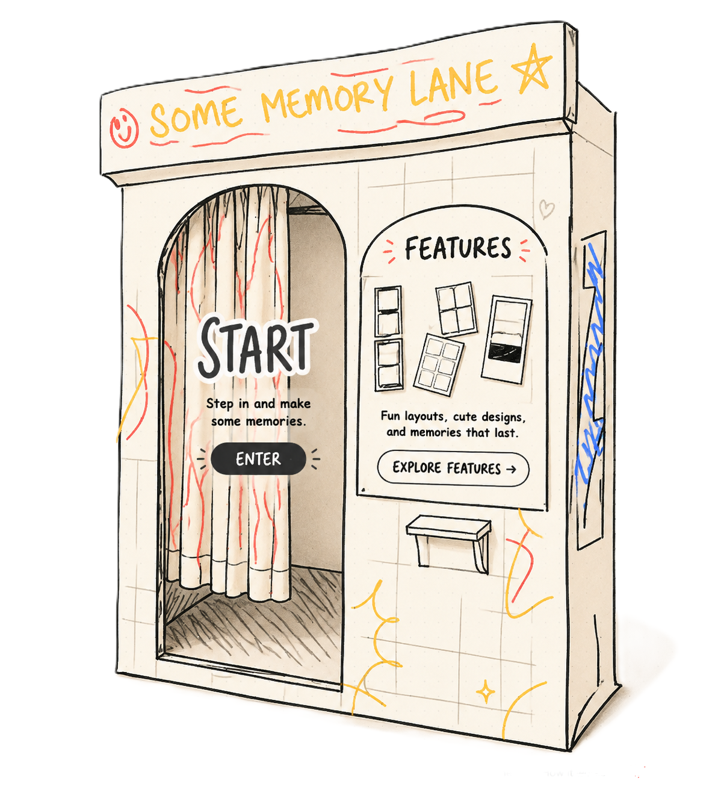

# Some Memory Lane

Some Memory Lane is a dependency-free, browser-based photobooth. It guides a visitor from choosing a photostrip through capturing webcam photos, compositing them into a themed strip, and downloading or printing the result—all in the browser.



## What it does

1. Choose a **Solo** session and a strip layout/design.
2. Grant camera permission and take the required number of photos with a guided countdown.
3. Review the captured photos while the session is in progress.
4. Generate a final JPEG strip in a `<canvas>` using the selected frame template.
5. Download the strip or open a print dialog, then finish the session and clear its saved photos.

The project also includes an interactive featured-memory wall, an optional looping music control, a privacy page, FAQ, about page, and a friendly fallback page for expired or incomplete sessions.

## Feature inventory

- Five layout types: classic four-photo strip, 2x4 strip, four-photo grid, three-photo strip, and single-photo Instax.
- 35 frame templates, including classic colorways, cat designs, and a numbered collection.
- Automatic capture count based on the selected template: 4, 3, or 1 photos.
- Camera controls for requesting permission, turning the camera on/off, restarting, and capturing with a countdown.
- Client-side composition, JPEG download, and print support.
- Session recovery while navigating between the camera and editor.
- Responsive UI, keyboard-accessible controls, reduced-motion handling, and descriptive image labels in key flows.
- Featured-wall interactions: drag strips, bring one to the front, or shuffle the wall.

## Technology and architecture

This is a static site—there is no framework, build step, package manager, server, database, or authentication layer.

| Area | Implementation |
| --- | --- |
| UI | HTML, CSS, and vanilla JavaScript |
| Camera | `navigator.mediaDevices.getUserMedia()` |
| Image creation | Canvas API and local frame-image assets |
| Session metadata / final result | `sessionStorage` |
| Captured-photo persistence | IndexedDB (`some-memory-lane` / `photo-sessions`) with a legacy `localStorage` fallback |
| Music preference | `localStorage` |
| Fonts | Google Fonts (Inter and Poppins) |

The main session flow is:

```text
index.html
  -> pages/start.html     choose session, layout, and template
  -> pages/camera.html    request camera and capture photos
  -> pages/edit.html      composite, download, print, or finish
  -> index.html           session cleanup returns here
```

`js/strip-catalog.js` is the shared source of truth for template metadata, including template dimensions, capture counts, categories, and asset paths. `js/photo-storage.js` encapsulates IndexedDB reads, writes, cleanup, and legacy-photo migration.

## Run locally

No installation is required. Serve the repository with a local web server and open the provided URL.

For example, with the VS Code **Live Server** extension, open `index.html` using **Open with Live Server**. You can also use any static-file server you prefer.

Use `localhost` or HTTPS. Browsers generally block camera access from a file opened directly with `file://`; when prompted, allow camera access.

## Browser requirements

- A current desktop or mobile browser with `getUserMedia`, Canvas, `sessionStorage`, and IndexedDB support.
- A working camera and permission to use it.
- Pop-ups allowed if the visitor wants to print, because printing opens a temporary print window.
- Internet access is optional for core functionality, but required to load the Google Fonts unless they are already cached.

## Project structure

```text
.
|- index.html                 # Landing page
|- fallback.html              # Recovery page for invalid/incomplete sessions
|- style.css, script.js       # Landing-page presentation and interactions
|- assets/
|  |- images/                 # Landing and featured-wall images
|  |- icons/                  # Favicons and music icon
|  |- music/                  # Optional background track
|  `- strip design/           # JPEG/PNG photostrip templates
|- css/                       # Page-specific and shared styles
|- js/
|  |- start.js                # Session and template selection
|  |- camera.js               # Camera lifecycle, countdown, and capture flow
|  |- edit.js                 # Canvas compositor, download, print, cleanup
|  |- strip-catalog.js        # Shared template catalog
|  |- photo-storage.js        # IndexedDB photo persistence
|  |- session-music.js        # Shared music control
|  `- features.js             # Featured-wall interactions
`- pages/
   |- start.html
   |- camera.html
   |- edit.html
   |- features.html
   |- about.html
   |- faq.html
   `- privacy.html
```

## Privacy and data handling

- Photos are captured and composed locally; this code does not upload them to a server.
- Captured photos are stored in IndexedDB during an active/in-progress session so the editor can restore them after navigation. Older browser state may be read from `localStorage` as a fallback.
- Choosing **Finish**, starting a new session, or restarting a session removes the current photo data. The final generated strip is kept in `sessionStorage` until the session is finished.
- The site stores the music preference locally. No account or personal information is required by the implemented flow.
- As with any browser storage, scripts running on the same origin can access it; do not add untrusted third-party scripts.

See [the in-app privacy page](pages/privacy.html) for visitor-facing language.

## Current project status

The core single-user photobooth flow is implemented. The following items are intentionally presented as future work rather than active functionality:

- **Duo** and **Group** sessions, room creation, and room joining are disabled and marked “Coming soon.”
- **Featured Wall uploads** are disabled. The wall currently displays bundled sample images only; it has no remote storage, moderation, or deletion service.
- The landing-page **Give Feedback** and **How it works** links currently route to the fallback page. `pages/feedback.html` and `pages/howitworks.html` are empty placeholders.
- There is no automated test suite, lint configuration, deployment configuration, or CI workflow in the repository at present.

## Development notes

- Keep template changes centralized in `js/strip-catalog.js`; the start page renders its choices from that catalog and the editor uses the same metadata to determine output size and placement.
- Test camera changes on both desktop and mobile, with permission granted and denied, and after reloading the camera/editor pages to verify storage recovery.
- Test every template after changing compositing code. JPEG frames use multiply blending while PNG frames use normal source-over drawing.
- When adding a public upload feature, add explicit consent, a server-side storage policy, moderation/deletion controls, and update the privacy policy before enabling it.

## License

No license file is currently included. Add one before distributing or accepting outside contributions.
